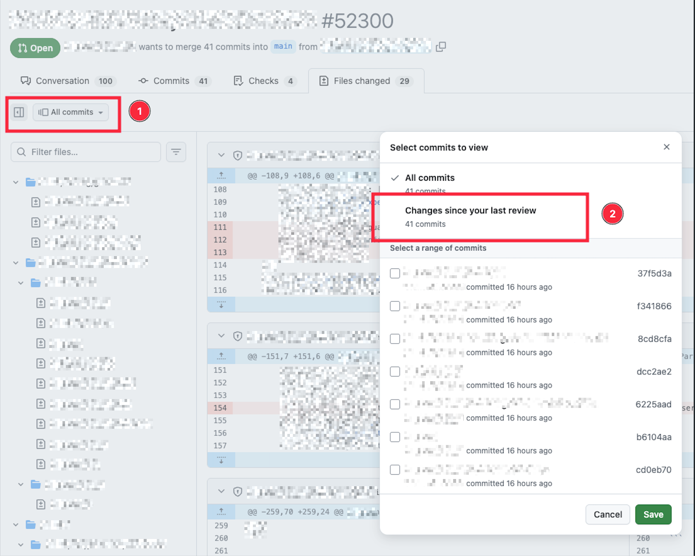
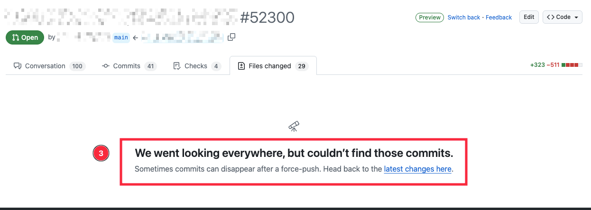

# GitHub

## Don't rebase and force push after code review

❌ DON'T rebase or force push once a review has started.

✅ DO: push new fixup commits instead of amending and force pushing.

GitHub's "Changes since your last review" feature lets reviewers see only what
changed since they last looked — saving them from re-reading the whole PR. A
rebase destroys this: the old commits disappear and the diff breaks.

In monorepos where PRs are squash-merged, force pushing is also pointless — the
history gets thrown away on merge anyway. It only makes reviewers' lives harder.

See
[Changes since last review — daisy.wtf](https://daisy.wtf/writing/github-changes-since-last-review/)
for a deeper look at why this breaks and how to work around it.
