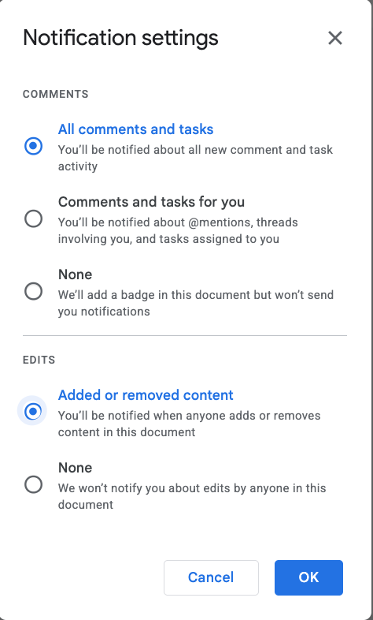
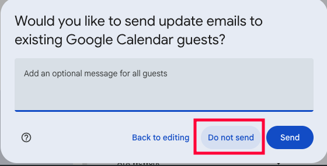

# Google

## Google Docs

### Get notified on all comments of a document

By default, Google Docs only notifies you about comments that mention you.

1. Open the document
2. Menu **Tools > Notification settings**
3. Choose **All comments and tasks** to be notified on all comments
4. Choose **Added or removed content** to be notified on all changes
5. Click **Ok**

## Google Calendar

### Don't spam guests when editing an event

❌ **DO NOT SEND EMAILS WHEN UPDATING THE ROOM**

When you save a change to a calendar event, Google asks if you want to send
update emails to guests.

Unless the change is relevant to them (time, location, new attendees), choose
**Do not send**.

