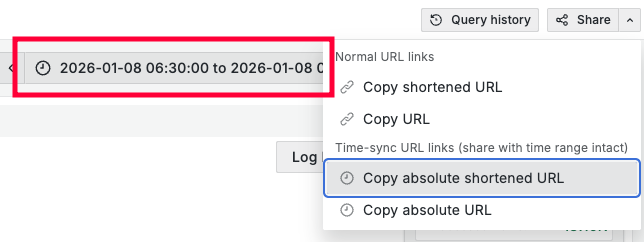

# Grafana

## Share absolute URLs

When you share a link to Grafana, prefer absolute URLs. So the link will still
be valid tomorrow, the day after, and so on.

This doesn't happen when someone, the following week, clicks a link you shared
with "Last 30 minutes".

✅ **DO**

❌ **DON'T**

