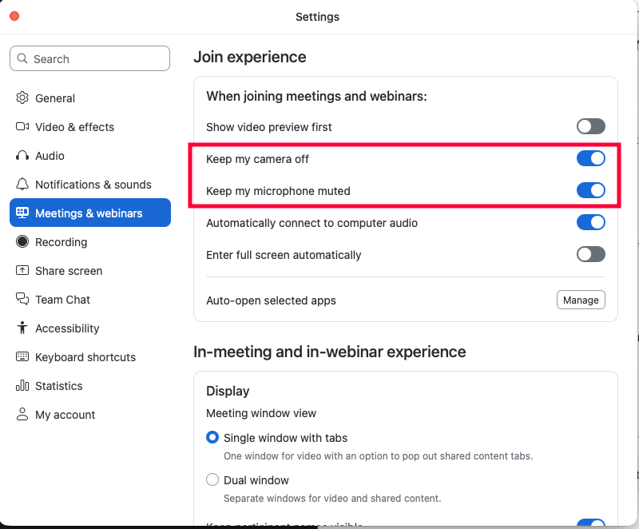

# Zoom

## Turn off mic and video when joining a meeting

- Go to **Settings > Meetings & Webinars > When joining meetings and webinars**
- Select "Keep my camera off"
- Select "Keep my microphone muted"

